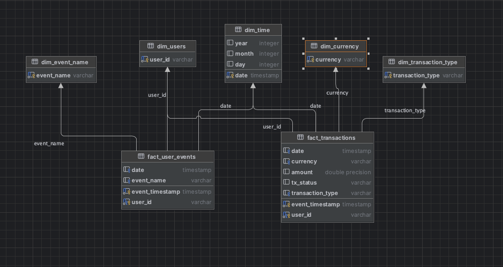

Bitso BI
============

For this one I created a Jupyter Notebook with ingestion + processing. Basically running every cell sequentially will do the trick.
 
Build & Run
------------
Build: 
~~~bash
    $ python3 -m pip install -r requirements.txt
~~~

Run:
    IMPORTANT!: Before running, extract the `data/deposit.zip` file, Github does not accept files larger than 100MB.
~~~bash
    $ python3 -m notebook 
~~~

Open the `bitso.ipynb` notebook and run the cells sequentially.

Structure
------------
1. Ingestion\
    The first cell will ingest data that's in the `data` folder. It will create 4 tables in our `raw` layer.
2. Processing\
    After ingestion the following Spark SQL queries will write facts and dimension tables.
3. Write CSV files\
    The `# Print schemas and export tables to CSV` will export the tables to the `output` folder as csv files. 
4. Analysis queries\
    The final cells have a BI question and the query necessary to answer that question.

In summary I used a Star Schema model with two facts and five dimension tables. Some of the dimensions seem to be anemic, but I believe they can be enriched in the future. Like the `dim_time` and `dim_event_name`
that can simplify filtering holidays, classify different types of events and so on. 

Final Thoughts
------------
I started using `dbt` for processing the data but since one of the files is too big to be used as a seed, I decided to use full Pyspark for simplicity.
`dbt` would deliver a cleaner solution with incremental models, easier to automate with `Airflow`, with simple tests, lineage, docs etc...
On the other hand a notebook is better for evaluation and quick test.

Again thank you for the opportunity!
Henrique
